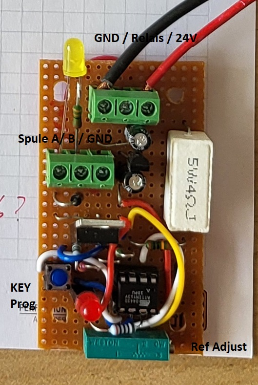

# Funktionsbeschreibung
 Einschalt Verzögerung um den Shunt Widerstand von 4Ω zu überbrücken.
 Der Shunt begrenzt den Einschalt-Strom auf ca. 6A

##  ✅ Ablauf
### Laden
 * Nache dem Einschalten wird 1 Sekunden geladen. 
 * --> langsam blinken (500ms)
### Warten auf Spannung 
 * Danach wird 3 Sekunden lang überprüft, ob die Spannund erreicht wurde. Falls ja, wird der Shunt überbrückt, das Relais zieht an. 
 * --> schnelles blinken mit 200ms Periode.
### Relais einschalten
* Die Relaisspannung wird nach 500ms auf 50% Haltespannung  gesenkt werden.
### Relai auf Haltespannung
 * Falls die Spannung unter der Referenzspannung liegt blinkt die LED mit 500ms Perione, sonst mit 2s.
 * Falls die Spannung auf unter 80% der Haltespannung fällt, wird wieder versucht das Relais voll einzuschalten.

## 💡  Programmieren der Referenzspannung
Den Schalter betätigen. Beim Loslassen wird die gemessene Spannung intern gespeichert und von dann an als Referenzspannung verwendet. 

Die abgespeicherte Referenzspannung entspricht 90% der gemessenen Spannung.

(Bei gedrückter Taste wird das Relais ausschaltet. Es blinkt schnell. )

# 🧠 Print

4Ω reduziert den Anlaufstrom auf 6A.
Die Last bei Leerlauf des DC/AC Wandles beträgt ca. 1 Ampere. Dadurch sollte die Spannung bis ca. 26V-(4Ω*1A) = 22V ansteigen.

# 🧷 ATtiny13 Pinbelegung

| Pin Nr. | AVR Pin | Belegung            | Funktion                                       |
|--------:|:--------|:--------------------|:-----------------------------------------------|
| 1       | PB5     | Reset (Standard)    | Standardmäßig Reset  ➜ Nur nutzbar, wenn Reset deaktiviert ist                          |
| 2       | PB3     | `UBATTTERY_PIN`     | Analog Input (ADC3) – Batteriespannung messen| 
| 3       | PB4     | n.c.                | ➜ Nur nutzbar, wenn Reset deaktiviert ist |            
| 4       | GND     | -                   | Masse                                          |
| 5       | PB0     | `KEY_PIN`           | Digital Input --> Programmiereingang, setzt Spannungsschwelle|
| 6       | PB1     | `RELAY_PIN`         | Digital Output (Relais)                        | 
| 7       | PB2     | `LED_PIN`           | Digital Output (LED) --> schaltet auf Null     |
| 8       | Vcc     | +                   | Betriebsspannung (5 V)                         |

https://components101.com/microcontrollers/attiny13-8-bit-avr-microcontroller 

# 🧩Pinlayout
                   +---\/---+
    RESET         –|1      8|– Vcc (5V)
    UBATTERY_PIN  -|2      7|– LED_PIN
    n.c (      )  –|3      6|– RELAY_PIN
    GND           –|4      5|– KEY_PIN 
                   +--------+

    
    #define LED_PIN PB2
    #define RELAY_PIN PB1
    #define KEY_PIN PB0

    #define UBATTTERY_PIN PB3

# 📌Spannungsteiler Spannungsmessung 
    [ 30V ] ── R1 (100kΩ) ──┬──────────┬─
                            |          |
                           R2 (20kΩ)   Poti 200kΩ ──> To ADC pin 2 (PB3)
                            |          |
                           GND        GND

Wir nehmen deinen Spannungsteiler:

    R1 = 100 kΩ
    R2 = 20 kΩ Parallel 200kΩ Poti

Vcc = 5 V → also ADC-Werte von 0 bis 1023

### 🧮 Schritt 1: Ausgangsspannung berechnen
Die Spannung am ADC-Pin ist:

𝑉out = 22𝑉×(𝑅1/(𝑅1+𝑅2)) = 22𝑉×(20𝑘Ω/120𝑘Ω)= 22𝑉×1/6 ≈ 3.67𝑉

### 🧮 Schritt 2: Potentiometer einstellen
Auf eine Spannung von 3.0V stellen, dies bei einer Eingangsspannung von 24V

## 🔧 IRLB8721-Anschluss am ATtiny13 (PB1)

**Ansicht von vorne (Pins unten):**
   IRLB8721 (Frontansicht, Pins unten)

    Gate   Drain   Source
     |       |       |
     |       |       +--→ GND
     |       |
     |       +--→ Relais → +24 V
     |
     +--→ 150 Ω in Serie mit PB1
     |
     +--→ 100 kΩ nach GND
     
**Beschreibung:**
- **Gate**: Wird über einen **150 Ω** Vorwiderstand von **PB1** angesteuert  
  – zusätzlich ein **100 kΩ Pull-Down**-Widerstand nach Masse  
- **Drain**: Schaltet das **Relais** gegen **+24 V Versorgung**  
- **Source**: Direkt mit **GND** verbunden  

# Freilaufdione nicht vergessen.
Das Relais am Ausgang der FETs. Diode antiparralle zum Relais.

# Learning
Leider konnten nicht zwei Analog-Signale einzulesen. Nur Pin 2 = ADC3 / PB3 funktionierte tadellos.
Desshalb wurde intern eine Spannungsreferenz verwendet, welche mit dem Taster programmierbar ist. Mit dem 200kΩ Poti kann die Schwelle erhöht werden.

